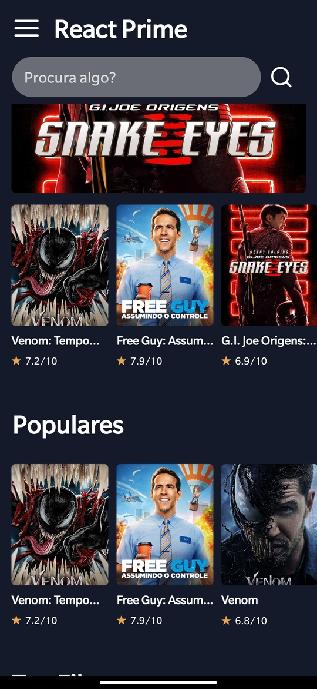
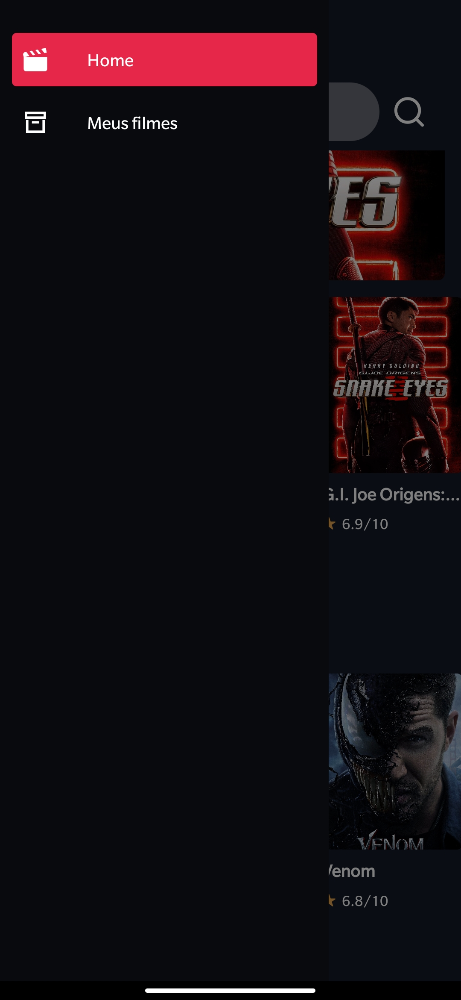
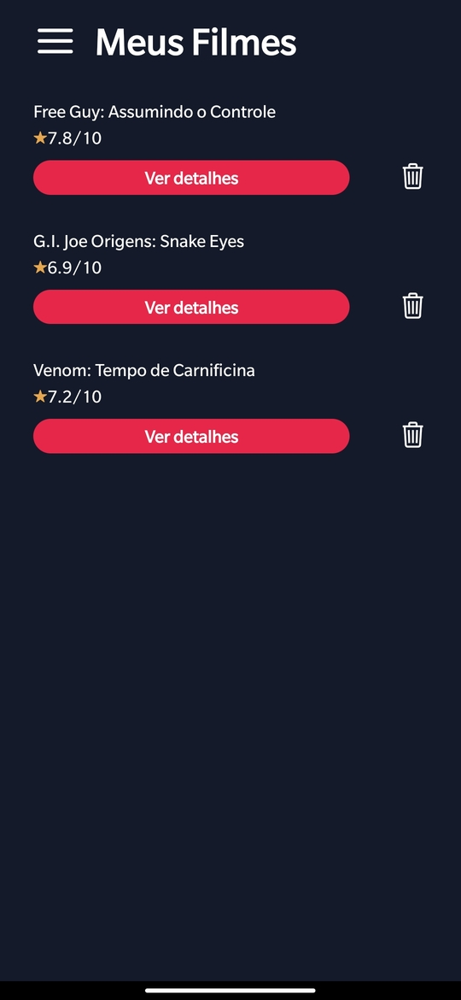

# Bem Vindo ao MovieDB React Native App

## Projeto desenvolvido com React Native + Expo

## Tecnologias utilizadas

- React Native
- React Navigation
- Async Storage
- Styled-components

## Instruções de Instalação

1. Clone o repositorio

`https://github.com/marcusjava/react_native_movieDB`

2. Instalação
   Pré-requisitos: NodeJS instalado `https://nodejs.org/en/`

- Expo CLI - `npm install --global expo-cli`
- Instalar dependencias - `expo install`
- Criar conta no site https://www.themoviedb.org
- Gerar key para acesso a API em https://www.themoviedb.org/settings/api
- Criar arquivo .env na raiz do projeto com a seguinte variavel `MOVIEDB_API_KEY="KEY GERADA"`
- Instalar a lib react-native-dotenv - `yarn add react-native-dotenv`
- Iniciar o projeto com expo start e abrir no emulador de sua preferencia

3. Executar projeto usando expo

- Instalar o Expo através da loja da Apple ou PlayStore
- Abrir o aplicativo no celular e escanear o QRCode deste site `https://expo.dev/@marcusreact/movie`
